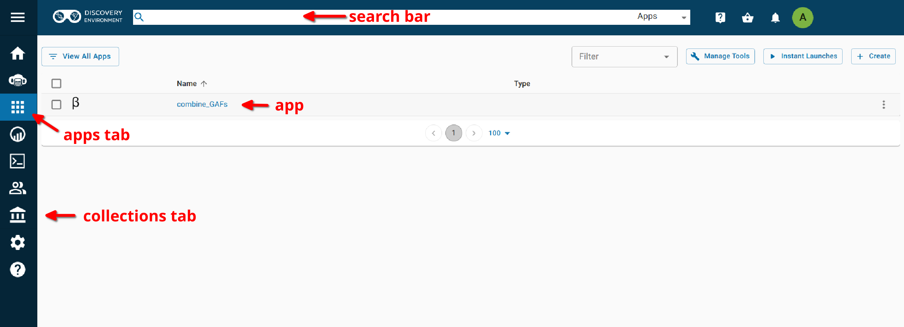
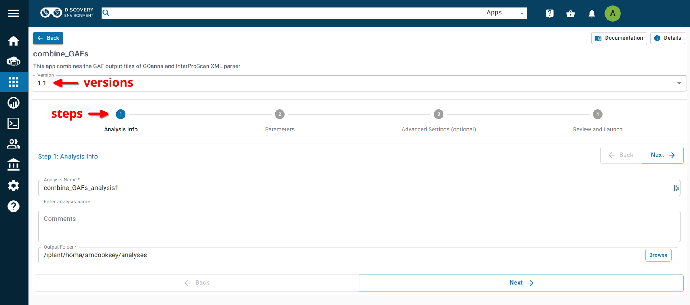

===========================
**Combine GAFs on CyVerse**
===========================

**Accessing GOanna in the Discovery Environment**
=================================================

1. `Create an account on CyVerse <user.cyverse.org>`_ (free)
2. Open the CyVerse Discovery Environment (DE) and login with your CyVerse credentials.
3. If you are new to the Discovery Environment (DE) the user guide can be found `here <https://learning.cyverse.org/projects/discovery-environment-guide/en/latest/>`_.

4. Click on the ‘Data’ button at the left side of the screen to access your files/folders. Upload your data to the DE.
5. To access the `combine_GAFs 1.0 <https://de.cyverse.org/de/?type=apps&app-id=d8219400-7b47-11e9-a097-008cfa5ae621&system-id=de>`_ app click on the ‘Apps’ button at the left side of the DE. 
6. Search for 'combine" in the search bar at the top of the ‘apps’ window (see below). The contents of the folder will appear in the main pane of the window. The combine_GAFs app is called ‘combine_GAFs 1.0’; click on the name to open the app.

|find_combine_gafs|

.. admonition:: Find Apps Easily with 'Communities'

    The GOanna 2.0 app belongs to the 'i5k' and 'AgBase' communties. You can join either of these communities and they will appear in the left-hand pane of your 'Apps' window (see above). 

    To join a community click on the person icon in the top-right corner of the Discovery Environment window and select 'Communities'. In the 'Communities' window choose 'all communities' from the drop-down list. A list of communities will appear in the main pane of this window. Select the one you wish to join by clicking on it and then clicking on the 'join' button.

**Using the Combine_GAFs App**
------------------------------
**Launching the App**
^^^^^^^^^^^^^^^^^^^^^

|combine_gafs|

**Analysis Name: Combine_GAFs_1.0_analysis1:**
This menu is used to name the job you will run so that you can find it later.
Analysis Name: The default name is "Combine_GAFs_1.0_analysis1". We recommend changing the 'analysis1' portion of this to reflect the data you are running.

**Comments:**
(Optional) You can add additional information in the comments section to distinguish your analyses further.

**Select output folder:**
This is where your results will be placed. The default (recommended) is your 'analyses' folder.

**Retain Inputs:**
Enabling this flag will copy all the input files into the analysis result folder. 

.. WARNING:: 

    Selecting this option will rapidly consume your allocated space. It is not recommended. Your inputs will always remain available in the folder in which you stored them.

**Input**
^^^^^^^^^
**GOanna GAF Output File:** This is the GAF file generated by a GOanna analysis.

**InterProScan XML Parser GAF Output File:** This is the GAF output file generated by an InterProScan XML Parser analysis. InterProScan itself does not produce this file, though some IntperProScan apps include this analysis. If it is missing from your InterProScan output you can generate it using the InterProScan XML Parser app.

**Output**
^^^^^^^^^^
**Output File Basename:** This will be the prefix for your output file (a .tsv extension will be added).

If your analysis fails please check the 'condor_stderr' file in the analysis output 'logs' folder. If that doesn't clarify the problem contact us at agbase@email.arizona.edu or support@cyverse.org.

