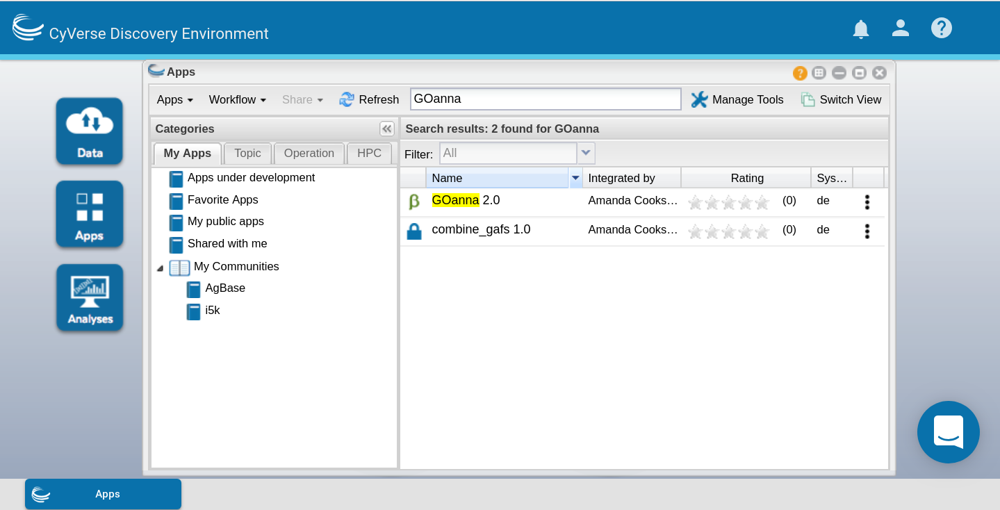
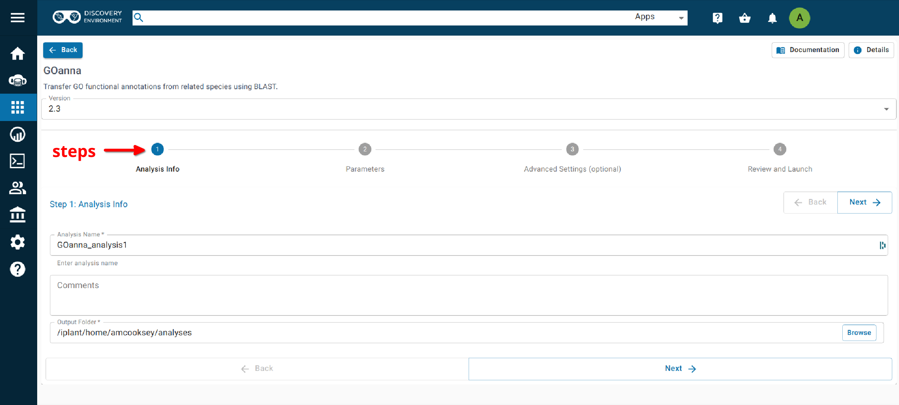

===========================
**GOanna on CyVerse**
===========================

**Accessing GOanna in the Discovery Environment**
=================================================

1. `Create an account on CyVerse <user.cyverse.org>`_ (free). The user guide can be found `here <https://learning.cyverse.org/>`_.
2. Open the CyVerse Discovery Environment (DE) and login with your CyVerse credentials.
3. Click on the ‘Data’ tab at the left side of the screen to access your files/folders. Upload your data to the DE.
4. There are several ways to access the GOanna app:

- Use the `direct link <https://de.cyverse.org/apps/de/f707a7a4-4c3c-11ee-bba8-008cfa5ae621>`_.
- Search for 'GOanna" in the search bar at the top of the ‘apps’ tab.
- Follow the AgBase collection (collections tab on left side of DE)

|find_goanna|

**Using the GOanna App**
========================
**Launching the App**
---------------------

|goanna|

**Step 1. Analysis Info**
^^^^^^^^^^^^^^^^^^^^^^^^^

**Version:** All of the versions of the GOanna are now available in one place. Plese select the you want from the drop down box. The latest version is best unless you need reproduce a previous analysis.

**Analysis Name:GOanna_analysis1:**
This menu is used to name the job you will run so that you can find it later.
The default name is "GOanna_analysis1". We recommend changing the 'analysis1' portion of this to reflect the data you are running.

**Comments:**
(Optional) You can add additional information in the comments section to distinguish your analyses further.

**Select output folder:**
This is where your results will be placed. The default (recommended) is your 'analyses' folder.

**Step 2. Parameters**
^^^^^^^^^^^^^^^^^^^^^^

The 'input' section is used to select the BLAST database and your input file.

**BLAST database basename:** BLAST databases are created by AgBase based upon proteins that have GO available and subsetted by phyla. We recommend selecting the database most closely related to the sequence used as input.

**Peptide FASTA file:** Use the Browse button on the right hand side to navigate to your Data folder and select your protein sequence file.

Use the 'parameters' section to select your BLAST parameters.

**Transfer GO with experimental evidence only:** We strongly recommend selecting the “yes” option from the dropdown menu so that only GO annotations based on experimental evidence codes will be transferred . This will ensure the best quality annotations for your data.

The remaining parameters are standard BLAST parameters, and their defaults can be seen beneath the fields.

.. admonition:: Determining BLAST Parameters to Use

    BLAST parameters are contingent on the BLAST database used and the composition of the input file, and so will change for each analysis.

    Make a subset of 100 randomly selected sequences from your larger dataset and use this as the input for GOanna to test for parameters that give good alignments.

    1. To test for good parameters use GOanna by selecting the same database you will use and setting relaxed parameters.

    2. Once you have run your subsetted file, use the html file to view alignments, select good alignments and note the parameters for these.

**Parse query and subject bar delimited sequence identifiers:** This option should be selected if you are using a fasta file with headers that include pipes (|). They will not format correctly otherwise.

    If the ‘parse-deflines’ option is not checked then BLAST will interpret the ID to be everything before the first space.

The 'output' section is used to format your GO annotation results into a standard gene association file format.

**Output File basename:** This will be the prefix for your output files. A good name choice is to use the fasta file name (without file extension).

**Database of query ID:** Use the database that sequences were obtained from (e.g. Refseq), or a recognizable project name if these sequences are not in a database (e.g., i5k project or Smith Lab). The default is 'user_input_db'.

**'Assigned by' field of your GAF output file:** Enter the name of the entity assigning the function (e.g. Agbase, or Smith Lab). This field is used to track who made the annotations. The default is 'user'.

**Taxon ID of the query species:** Enter the NCBI taxon number for your species. This can be found by searching for your species name (common or scientific) in the `NCBI taxon database <https://www.ncbi.nlm.nih.gov/taxonomy>`_. The default is "0000".

**Step3. Adavanced Settings (optional)**
^^^^^^^^^^^^^^^^^^^^^^^^^^^^^^^^^^^^^^^^

This page allows you specifiy compute requirements for your analysis (e.g. more memory if your analysis is particularly large). You should be able to leave the defaults for most analyses.

**Step4. Review and Launch**
^^^^^^^^^^^^^^^^^^^^^^^^^^^^

This will display all of the parameters you have set (other than default). Missing information that is required will displayed in red. Make sure you are happy with your choices and then clicke the 'launch' button at the bottom.

**Understanding Your Results**
==============================

If all goes well, you should get 4 output files and a ‘logs’ folder.

**<basename>.asn:** This is standard BLAST output format that allows for conversion to other formats. You probably won’t need to look at this output.

**<basename>.html:** This output displays in your web browser so that you can view pairwise alignments to determine BLAST parameters.

**<basename>.tsv:** This is the tab-delimited BLAST output that can be opened and sorted in Excel to determine BLAST parameter values. The file contains the following columns:

- query ID
- query length
- query start
- query end
- subject ID
- subject length
- subject start
- subject end
- e-value
- percent ID
- query coverage
- percent positive ID
- gap openings
- total gaps
- bitscore
- raw score

For more information on the BLAST output parameters see the `NCBI BLAST documentation <https://www.ncbi.nlm.nih.gov/books/NBK279684/#_appendices_Options_for_the_commandline_a_.>`_.

**<basename>_goanna_gaf.tsv:** This is the standard tab-separated `GO annotation file format <https://geneontology.github.io/docs/go-annotation-file-gaf-format-2.2/>`_  that is used by the GO Consortium and by software tools that accept GO annotation files to do GO enrichment. 

If you see more files in your output folder there may have been an error in the analysis or there may have been no GO to transfer. Check the 'condor_stderr' file in the analysis output 'logs' folder.

If that doesn't clarify the problem contact us at agbase@email.arizona.edu or support@cyverse.org.

