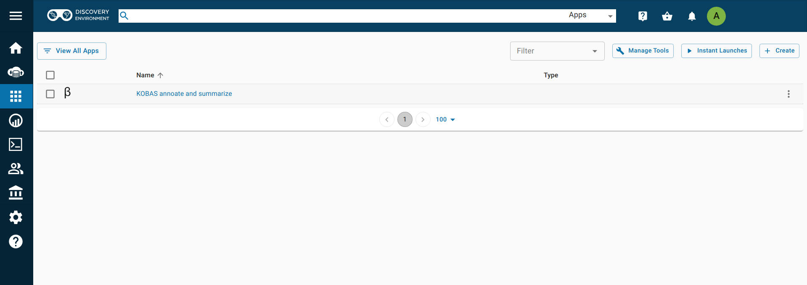
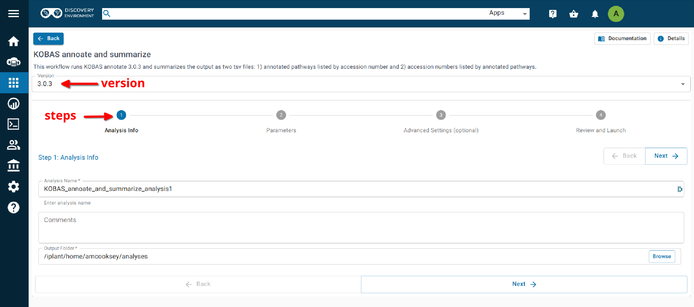
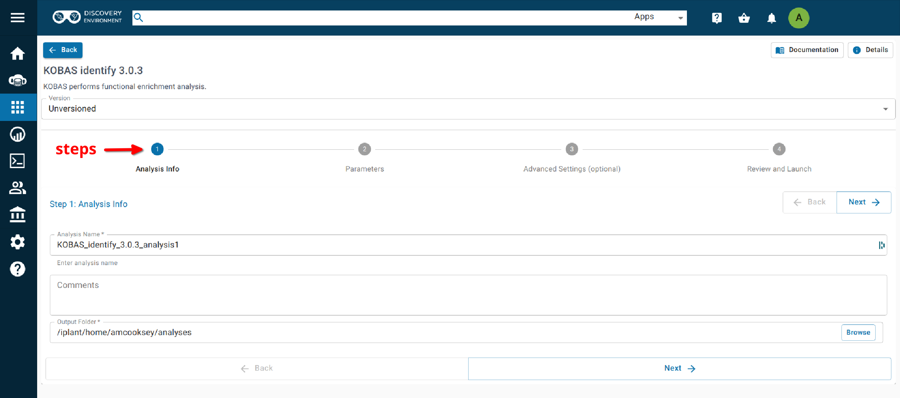
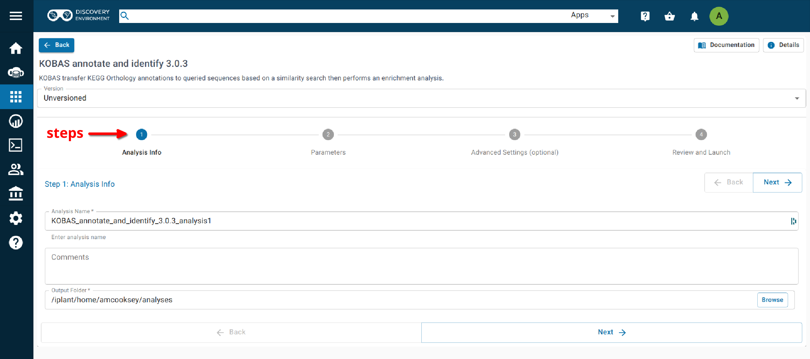

===========================
**KOBAS on CyVerse**
===========================

**Accessing KOBAS in the Discovery Environment**
================================================

1. `Create an account on CyVerse <user.cyverse.org>`_ (free). The Discovery Environment (DE) the user guide can be found `here <https://learning.cyverse.org>`_.
2. Open the CyVerse Discovery Environment (DE) and login with your CyVerse credentials.
3. There are several ways to access the GOanna app:

- Use the `direct link <https://de.cyverse.org/apps/de/71cb43ba-cd8a-11ed-90f2-008cfa5ae621>`_.
- Search for 'KOBAS in the search bar at the top of the ‘apps’ tab.
- Follow the AgBase collection (collections tab on left side of DE)

The KOBAS apps are called:

- **NEW** `KOBAS annotate and summarize <https://de.cyverse.org/apps/de/71cb43ba-cd8a-11ed-90f2-008cfa5ae621>`_
- `KOBAS annotate 3.0.3 <https://de.cyverse.org/de/?type=apps&app-id=070f519e-983f-11e9-b659-008cfa5ae621&system-id=de>`_
- `KOBAS identify 3.0.3 <https://de.cyverse.org/de/?type=apps&app-id=9e0a429c-dee0-11e9-948a-008cfa5ae621&system-id=de>`_
- `KOBAS annotate and identify 3.0.3 <https://de.cyverse.org/de/?type=apps&app-id=2959dcb4-d0d0-11e9-9f25-008cfa5ae621&system-id=de>`_

.. admonition:: **NEW** KOBAS annotate and summarize

    The new KOBAS annotate and summarize app is version 3.0.3. In addition to the annotate function it also performs a summary step. We recommend using this app rather than the annotate 3.0.3 app.

|find_kobas|

**KOBAS annotate and summarize**
================================
**Launching the app**
---------------------

|kobas_anno|

**Step 1. Analysis Info**
^^^^^^^^^^^^^^^^^^^^^^^^^

**Analysis Name: KOBAS_annoate_and_summarize_analysis1:**
This menu is used to name the job you will run so that you can find it later.
Analysis Name: The default name is "KOBAS_annoate_and_summarize_analysis1". We recommend changing the 'analysis1' portion of this to reflect the data you are running.

**Comments:**
(Optional) You can add additional information in the comments section to distinguish your analyses further.

**Select output folder:**
This is where your results will be placed. The default (recommended) is your 'analyses' folder.

**Step 2. Parameters**
^^^^^^^^^^^^^^^^^^^^^^

**Input File:** Use the 'browse' button on the right side of the field to navigate to your input file.

**Input File Type:** Select your input file type from the drop-down list. If your file type isn't there then the app does not support that file type. 

**Species Code:** Enter the species for the species of the sequences in your input file. 

.. NOTE:: 

    If you don't know the code for your species it can be found here: https://www.kegg.jp/kegg/catalog/org_list.html 
    **Not all KEGG species are available through KOBAS.**

    If your species of interest is not available then you should choose the code for the closest-related species available

**E value:** This is the evalue to use in the BLAST search. The default is 1e-5.

**Rank:** rank cutoff for valid hits from BLAST result. Default is 5.

**Covergage:** subject coverage cutoff for BLAST. Default is 0.

**Ortholog:** when checked KOBAS will only use orthologs for cross species annotation.

**Output File Name:** Provide an output file name .

For information on outputs see :ref:`Understanding Your Results: Annotate <annotateresults>`

**Step3. Adavanced Settings (optional)**
^^^^^^^^^^^^^^^^^^^^^^^^^^^^^^^^^^^^^^^^

This page allows you specifiy compute requirements for your analysis (e.g. more memory if your analysis is particularly large). You should be able to leave the defaults for most analyses.

**Step4. Review and Launch**
^^^^^^^^^^^^^^^^^^^^^^^^^^^^

This will display all of the parameters you have set (other than default). Missing information that is required will displayed in red. Make sure you are happy with your choices and then clicke the 'launch' button at the bottom.

**Understanding Your Annotate Results**
----------------------------------------

If all goes well, you should get the following:

- **logs folder:** This folder contains the 'conder_stderr' and 'condor_stdout' files. The files record feedback, progress and, importantly, any errors the app encountered during the analysis. You won't normally need to look at these but they are very helpful in figuring out what may have happened if your output doesn't look like you expected.

- **seq_pep folder:** This folder contains the BLAST database files used in your analysis.
- **sqlite3 folder:** This folder contains the annotation database files used in your analysis
- **<species>.tsv:** This is the tab-delimited output from the BLAST search. It is unlikely that you will need to look at this file.
- **<output_prefix>.txt:** KOBAS-annotate generates a text file with the name you provide. It has two sections.
- **<output_prefix>.txt_KOBAS_acc_pathways.tsv:** A tab-delimited file with accession number and all of the annoations made to that accession.
- **<output_prefix>.txt_KOBAS_pathwyas_acc.tsv:** A tab-delimited file with pathways and of all of the accession annotated with that pathway.

The first section of <output_prefix>.txt looks like this:

.. code-block:: bash

    ##dme	Drosophila melanogaster (fruit fly)
    ##Method: BLAST	Options: evalue <= 1e-05
    ##Summary:	87 succeed, 0 fail

    #Query	Gene ID|Gene name|Hyperlink
    lcl|NW_020311285.1_prot_XP_012256083.1_15	dme:Dmel_CG34349|Unc-13-4B|http://www.genome.jp/dbget-bin/www_bget?dme:Dmel_CG34349
    lcl|NW_020311286.1_prot_XP_020708336.1_46	dme:Dmel_CG6963|gish|http://www.genome.jp/dbget-bin/www_bget?dme:Dmel_CG6963
    lcl|NW_020311285.1_prot_XP_020707987.1_39	dme:Dmel_CG30403||http://www.genome.jp/dbget-bin/www_bget?dme:Dmel_CG30403
    
The second section of <output_prefix>.txt follows a dashed line and looks like this:

.. code-block:: bash

    --------------------

    ////
    Query:              	lcl|NW_020311285.1_prot_XP_012256083.1_15
    Gene:               	dme:Dmel_CG34349	Unc-13-4B
    Entrez Gene ID:      	43002
    ////
    Query:              	lcl|NW_020311286.1_prot_XP_020708336.1_46
    Gene:               	dme:Dmel_CG6963	gish
    Entrez Gene ID:      	49701
    Pathway:            	Hedgehog signaling pathway - fly	KEGG PATHWAY	dme04341
    ////
    Query:              	lcl|NW_020311285.1_prot_XP_020707987.1_39
    Gene:               	dme:Dmel_CG30403	
    Entrez Gene ID:      	246595
    ////
    Query:              	lcl|NW_020311285.1_prot_XP_020707989.1_40
    Gene:               	dme:Dmel_CG6148	Past1
    Entrez Gene ID:      	41569
    Pathway:            	Endocytosis	KEGG PATHWAY	dme04144
                                Hemostasis	Reactome	R-DME-109582
                    	        Factors involved in megakaryocyte development and platelet production	Reactome	R-DME-98323

The <output_prefix>.txt_KOBAS_acc_pathways.tsv file looks like this:

XP_018223853.1	Reactome:R-SCE-6782135,KEGG:sce03420,Reactome:R-SCE-113418,Reactome:R-SCE-3700989,Reactome:R-SCE-73894,Reactome:R-SCE-73776,KEGG:sce03022,Reactome:R-SCE-6796648
XP_018222686.1	Reactome:R-SCE-5689603,KEGG:sce03050,Reactome:R-SCE-392499,Reactome:R-SCE-168249,Reactome:R-SCE-597592,Reactome:R-SCE-1236975,Reactome:R-SCE-1236978
XP_018223153.1	KEGG:sce01100,KEGG:sce01110,KEGG:sce01130,KEGG:sce01200,KEGG:sce01230,BioCyc:NONOXIPENT-PWY,BioCyc:PENTOSE-P-PWY,KEGG:sce00030
XP_018220571.1	KEGG:sce01100,KEGG:sce00270,KEGG:sce00480,KEGG:sce00410,KEGG:sce00330,BioCyc:ARGSPECAT-PWY

The <output_prefix>.txt_KOBAS_pathwyas_acc.tsv file looks like this:

KEGG:sce01100	XP_018223153.1,XP_018220571.1,XP_018219513.1
Reactome:R-SCE-5688426	XP_018222686.1
KEGG:sce03022	XP_018223853.1
Reactome:R-SCE-75105	XP_018219513.1
Reactome:R-SCE-597592	XP_018222686.1

If your analysis doesn't complete as you expected please look at your 'condor_stderr' and 'condor_stdout' files. If that doesn't clarify the problem contact us at agbase@email.arizona.edu or support@cyverse.org.

**KOBAS identify 3.0.3**
========================

**Launching the App**
---------------------

|kobas_ident|

**Step 1. Analysis Info**
^^^^^^^^^^^^^^^^^^^^^^^^^

**Analysis Name: KOBAS_identify_3.0.3_analysis_1:**
This menu is used to name the job you will run so that you can find it later.
Analysis Name: The default name is "KOBAS_identify_3.0.3_analysis1". We recommend changing the 'analysis1' portion of this to reflect the data you are running.

**Comments:**
(Optional) You can add additional information in the comments section to distinguish your analyses further.

**Select output folder:**
This is where your results will be placed. The default (recommended) is your 'analyses' folder.

**Step 2. Parameters**
^^^^^^^^^^^^^^^^^^^^^^

**Foreground File:** Use the 'browse' button on the right side of the field to navigate to your input file. This should be the output of KOBAS annotate.

**Background:** Enter the species for the species of the sequences in your input file. 

.. NOTE:: 

    If you don't know the code for your species it can be found here: https://www.kegg.jp/kegg/catalog/org_list.html

    If your species of interest is not available then you should choose the code for the closest-related species available

**Cutoff:** Annotation terms with less than cutoff number of genes are not used for statistical tests. Default is 5. 

**Method:** Choose the statistical method to be used from the drop-down list. Default is hypergeometric/Fisher's Exact.

**FDR:** Method for determining false discovery rate. Default is Benjamnini-Hochberg.

**Output File Name:** Provide an output file name.

**Step3. Adavanced Settings (optional)**
^^^^^^^^^^^^^^^^^^^^^^^^^^^^^^^^^^^^^^^^

This page allows you specifiy compute requirements for your analysis (e.g. more memory if your analysis is particularly large). You should be able to leave the defaults for most analyses.

**Step4. Review and Launch**
^^^^^^^^^^^^^^^^^^^^^^^^^^^^

This will display all of the parameters you have set (other than default). Missing information that is required will displayed in red. Make sure you are happy with your choices and then clicke the 'launch' button at the bottom.

**Understanding Your Identify Results**
---------------------------------------

If all goes well, you should get the following:

- **logs folder:** This folder contains the 'conder_stderr' and 'condor_stdout' files. The files record feedback, progress and, importantly, any errors the app encountered during the analysis. You won't normally need to look at these but they are very helpful in figuring out what may have happened if your output doesn't look like you expected.

- **sqlite3 folder:** This folder contains the annotation database files used in your analysis

- **<output_file_name_you_provided>:** KOBAS identify generates a text file with the name you provide.

.. code-block:: none

    ##Databases: PANTHER, KEGG PATHWAY, Reactome, BioCyc
    ##Statistical test method: hypergeometric test / Fisher's exact test
    ##FDR correction method: Benjamini and Hochberg

    #Term	Database	ID	Input number	Background number	P-Value	Corrected P-Value	Input	Hyperlink
    Hedgehog signaling pathway - fly	KEGG PATHWAY	dme04341	12	33	3.20002656734e-18	1.76001461204e-16	lcl|NW_020311286.1_prot_XP_012256678.1_51|lcl|NW_020311286.1_prot_XP_025602973.1_48|lcl|NW_020311286.1_prot_XP_012256683.1_52|lcl|NW_020311286.1_prot_XP_012256679.1_55|lcl|NW_020311286.1_prot_XP_012256674.1_54|lcl|NW_020311286.1_prot_XP_020708336.1_46|lcl|NW_020311285.1_prot_XP_012256108.1_32|lcl|NW_020311286.1_prot_XP_012256682.1_53|lcl|NW_020311286.1_prot_XP_025603025.1_47|lcl|NW_020311286.1_prot_XP_020708334.1_49|lcl|NW_020311285.1_prot_XP_012256109.1_33|lcl|NW_020311286.1_prot_XP_020708333.1_50	http://www.genome.jp/kegg-bin/show_pathway?dme04341/dme:Dmel_CG6963%09red/dme:Dmel_CG6054%09red
    Hedgehog signaling pathway	PANTHER	P00025	6	13	3.6166668094e-10	9.94583372585e-09	lcl|NW_020311286.1_prot_XP_025602279.1_78|lcl|NW_020311286.1_prot_XP_025602289.1_76|lcl|NW_020311286.1_prot_XP_025602264.1_79|lcl|NW_020311285.1_prot_XP_012256108.1_32|lcl|NW_020311285.1_prot_XP_012256109.1_33|lcl|NW_020311286.1_prot_XP_012256943.1_77	http://www.pantherdb.org/pathway/pathwayDiagram.jsp?catAccession=P00025
    Signaling by NOTCH2	Reactome	R-DME-1980145	3	8	2.00259649553e-05	0.000275357018136	lcl|NW_020311285.1_prot_XP_012256118.1_28|lcl|NW_020311285.1_prot_XP_012256117.1_27|lcl|NW_020311285.1_prot_XP_012256119.1_26	http://www.reactome.org/cgi-bin/eventbrowser_st_id?ST_ID=R-DME-1980145

If your analysis doesn't complete as you expected please look at your 'condor_stderr' and 'condor_stdout' files. If that doesn't clarify the problem contact us at agbase@email.arizona.edu or support@cyverse.org.

**KOBAS annotate and identify 3.0.3**
=====================================

**Launching the App**
---------------------

|kobas_annoident|

This app runs both the annotate and identify analyses together as a convenience for user who wish to run both steps.

**Step 1. Analysis Info**
^^^^^^^^^^^^^^^^^^^^^^^^^

**Analysis Name: KOBAS_annotate_and_identify_3.0.3_analysis_1:**
This menu is used to name the job you will run so that you can find it later.
Analysis Name: The default name is "KOBAS_annotate_identify_3.0.3_analysis1". We recommend changing the 'analysis1' portion of this to reflect the data you are running.

**Comments:**
(Optional) You can add additional information in the comments section to distinguish your analyses further.

**Select output folder:**
This is where your results will be placed. The default (recommended) is your 'analyses' folder.

**Step 2. Parameters**
^^^^^^^^^^^^^^^^^^^^^^

**Input**
^^^^^^^^^

**Input File:** Use the 'browse' button on the right side of the field to navigate to your input file.

**Input File Type:** Select your input file type from the drop-down list. If your file type isn't there then the app does not support that file type. 

**Annotate Options**
^^^^^^^^^^^^^^^^^^^^

**Species Code:** Enter the species for the species of the sequences in your input file. 

.. NOTE:: 

    If you don't know the code for your species it can be found here: https://www.kegg.jp/kegg/catalog/org_list.html

    If your species of interest is not available then you should choose the code for the closest-related species available

**E value:** This is the evalue to use in the BLAST search. The default is 1e-5.

**Rank:** rank cutoff for valid hits from BLAST result. Default is 5.

**Covergage:** subject coverage cutoff for BLAST. Default is 0.

**Ortholog:** when checked KOBAS will only use orthologs for cross species annotation.

**Identify Options**
^^^^^^^^^^^^^^^^^^^^

**Cutoff:** Annotation terms with less than cutoff number of genes are not used for statistical tests. Default is 5. 

**Method:** Choose the statistical method to be used from the drop-down list. Default is hypergeometric/Fisher's Exact.

**FDR:** Method for determining false discovery rate. Default is Benjamnini-Hochberg.

**Output**
^^^^^^^^^^

**Output File Basename:** This will the the prefix of your output files.

**Step3. Adavanced Settings (optional)**
^^^^^^^^^^^^^^^^^^^^^^^^^^^^^^^^^^^^^^^^

This page allows you specifiy compute requirements for your analysis (e.g. more memory if your analysis is particularly large). You should be able to leave the defaults for most analyses.

**Step4. Review and Launch**
^^^^^^^^^^^^^^^^^^^^^^^^^^^^

This will display all of the parameters you have set (other than default). Missing information that is required will displayed in red. Make sure you are happy with your choices and then clicke the 'launch' button at the bottom.

If your analysis doesn't complete as you expected please look at your 'condor_stderr' and 'condor_stdout' files. If that doesn't clarify the problem contact us at agbase@email.arizona.edu or support@cyverse.org.

